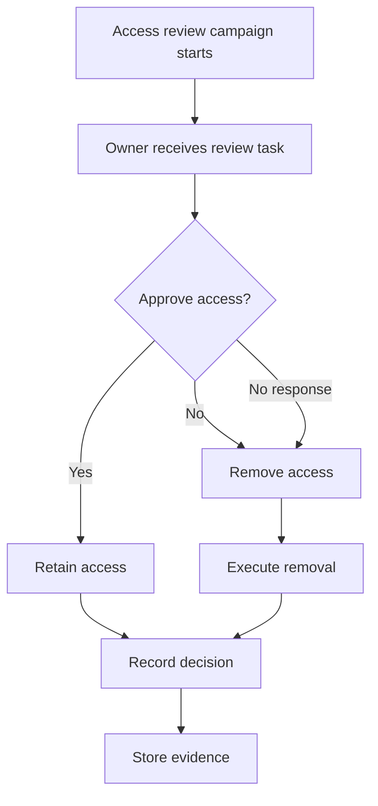

# Access Reviews (Campaign Execution + Evidence)

> [!IMPORTANT]
> **Governance Change Policy:** Once marked **COMPLETE**, this access review process is **IMMUTABLE**. Deviations require documented justification, approval, and evidence update.

---

## Strategic Goal
Establish a repeatable access review process that validates user access against business need, detects privilege creep, and produces **defensible evidence** suitable for audit review.

This process ensures access remains **intentional, approved, and current** over time.

---

## What This Proves
- I treat access reviews as an **operational control**, not a checkbox exercise.
- I understand how access drift occurs after onboarding and role changes.
- I can execute and evidence reviews that satisfy test of design and test of effectiveness.
- I align technical access decisions with business ownership and accountability.

---

## Governance Decisions
- Access reviews are owned by **business or system owners**, not IT alone.
- Reviews are scheduled, tracked, and evidenced on a fixed cadence.
- Non-response defaults to **access removal**.
- Exceptions are documented, approved, and time-bound.
- High-risk access is reviewed more frequently.

---

## Scope & Non-Goals
| In scope | Out of scope (by design) |
| --- | --- |
| Group-based RBAC assignments | Application-internal entitlement engines |
| Privileged and sensitive access | Endpoint local admin access |
| Periodic certification campaigns | Continuous real-time access decisions |
| Evidence retention | Fully automated IGA platform |

---

## Operating Baseline
| Item | Standard |
| --- | --- |
| Review cadence | Quarterly (minimum) |
| Review owner | Manager / App Owner |
| Review method | Campaign-based certification |
| Default action | Remove access if not approved |
| Evidence | Stored per campaign |

---

## Visual Logic (Access Review Flow)

---

## Review Types
| Review Type | Target | Cadence | Owner |
| --- | --- | --- | --- |
| Standard user access | Role-based groups | Quarterly | Manager |
| Privileged access | Admin / elevated roles | Monthly or Quarterly | Security |
| Sensitive systems | Finance, Security, Prod | Quarterly | System Owner |
| Exceptions | Temporary access | Monthly | Risk Owner |

---

## Steps I Take (Only What Matters)
1. Define review scope (groups, roles, systems).
2. Assign accountable reviewer (business owner).
3. Launch review campaign with deadline.
4. Track approvals, removals, and non-responses.
5. Enforce removal for denied or unanswered items.
6. Capture decision and execution evidence.
7. Retain evidence per policy.

---

## Audit Tests

### Test of Design
- [ ] Access review process is documented and approved.
- [ ] Review cadence and ownership are defined.
- [ ] Non-response handling is documented.
- [ ] Exceptions require approval and expiration.

### Test of Effectiveness
- [ ] Sample campaigns show completed reviews.
- [ ] Denied access is removed within defined SLA.
- [ ] Evidence shows reviewer identity and decision.
- [ ] Privileged access reviews occur on schedule.

---

## Verification

**Expected**
- Access aligns with current job function.
- Stale or excessive access is removed.
- Review decisions are traceable to owners.

**Observed**
- To be captured during execution and retained as evidence.

---

## Evidence
Evidence Index: [`./evidence/evidence-index.md`](./evidence/evidence-index.md)

Minimum evidence artifacts:
- EV-YYYY-MM-DD-001 — Campaign definition and scope
- EV-YYYY-MM-DD-002 — Reviewer decision export
- EV-YYYY-MM-DD-003 — Access removal confirmation
- EV-YYYY-MM-DD-004 — Exception approval (if applicable)

---

## Controls Mapped
- NIST 800-53: AC-2, AC-3, AC-6, AU-2, AU-12

---

## Navigation
- Repo README: [Home](../README.md)
- Pillar README: [01 — Identity Governance](./README.md)
- Related Controls:
  - [JML Lifecycle Workflow](./JML_Lifecycle_Workflow.md)
  - [RBAC Least Privilege Map](./RBAC_Least_Privilege_Map.md)
