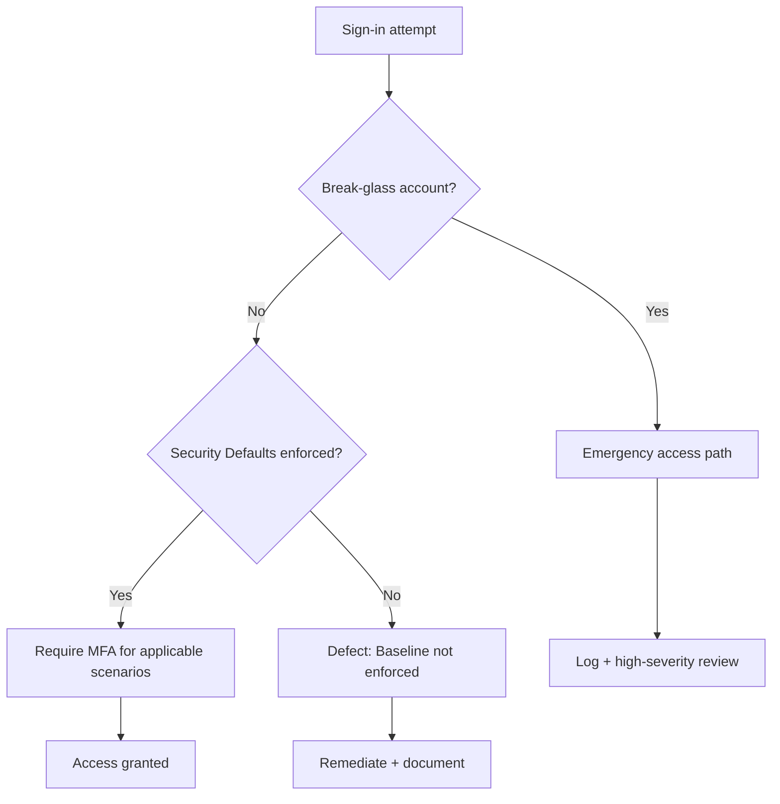

# Conditional Access Baseline (MFA + Break-Glass + Exceptions)

> [!IMPORTANT]
> **Governance Change Policy:** Once marked **COMPLETE**, this baseline is **IMMUTABLE**. Deviations require a documented **Risk Acceptance (RA)** and entry into the **Exception Register** (`/EXCEPTION_REGISTER.md`).

---

## Strategic Goal
Establish a defensible authentication enforcement baseline that:
- enforces strong authentication for interactive users,
- preserves a controlled emergency access path (break-glass),
- constrains authentication methods to approved options,
- and provides audit-ready verification using sign-in evidence.

This baseline is designed to withstand real-world identity attack patterns and formal audit review.

---

## Licensing Constraint (Current Tenant State)
This tenant does not have sufficient Microsoft Entra ID Premium licensing to create **Conditional Access** policies.

**Therefore, the baseline is implemented using:**
- **Security Defaults** (baseline MFA posture + recommended protections)
- **Authentication Methods Policy** (method governance)
- **Break-glass accounts** (emergency access governance)
- **Sign-in logs** (verification evidence)

**Gap (documented):**
Conditional Access policy-level targeting (cloud apps, device platform conditions, sign-in risk) is not available in this tenant. Evidence is retained showing the license gate.

---

## What This Proves
- I treat authentication enforcement as a **governance control**, not a UI configuration.
- I preserve emergency access while preventing broad bypass patterns.
- I can document a baseline even under licensing constraints without overstating capabilities.
- I can produce evidence suitable for **test of design** and **test of effectiveness**.

---

## Governance Decisions
- Authentication enforcement must be **documented, reviewable, and testable**.
- Emergency access is implemented using **two break-glass accounts**, isolated and monitored.
- Break-glass accounts are governed by strict usage rules and are not used for normal operations.
- Authentication methods are governed using a tenant-level **Authentication Methods Policy**.
- Deviations from baseline controls require **Risk Acceptance** and must expire.

---

## Scope & Non-Goals
| In scope | Out of scope (by design) |
| --- | --- |
| Baseline MFA posture via Security Defaults | Conditional Access policy creation (license-gated) |
| Break-glass governance | Risk-based CA controls (sign-in risk / user risk) |
| Authentication Methods Policy | Device compliance enforcement (Intune-dependent) |
| Sign-in log verification | Continuous Access Evaluation tuning |

---

## Operating Baseline
| Item | Standard |
| --- | --- |
| Identity platform | Microsoft Entra ID |
| Baseline enforcement | Security Defaults (tenant-level) |
| Method governance | Authentication Methods Policy |
| Emergency access | Two break-glass accounts |
| Verification source | Sign-in logs (Entra ID) |
| Evidence retention | Per repo evidence standards |

---

## Visual Logic (Decision Flow)

---

## Control Set (Design)

### Primary Controls
| Control ID | Control | Implementation (this tenant) |
| --- | --- | --- |
| AUTH-01 | Baseline MFA posture | Security Defaults enabled |
| AUTH-02 | Emergency access governance | Two break-glass accounts + restricted use |
| AUTH-03 | Authentication method governance | Authentication Methods Policy configured |
| AUTH-04 | Verification & auditability | Sign-in logs reviewed and retained as evidence |

### Exception Model
**Permitted exceptions**
- Break-glass emergency accounts (pre-approved)
- Temporary service access where required (time-bound)
- Vendor/partner access only with documented scope + expiration

**Exception requirements**
- Documented justification
- Explicit owner
- Time-bound expiration
- Evidence retained (screenshots/logs) + entry in `/EXCEPTION_REGISTER.md`

---

## Steps I Take (Only What Matters)

1. **Confirm licensing constraint and document it**
   - Validate that Conditional Access policy creation is blocked in the tenant
   - Capture evidence of the license gate

2. **Enable and verify Security Defaults**
   - Confirm Security Defaults are enabled (baseline MFA posture)
   - Capture evidence of the tenant posture

3. **Establish break-glass accounts**
   - Confirm two accounts exist (BG-Admin-01, BG-Admin-02)
   - Confirm they have required directory recovery permissions (Global Admin assignment where intended)
   - Capture evidence of existence and role coverage

4. **Govern authentication methods**
   - Review Authentication Methods Policy configuration
   - Confirm allowed methods align with baseline expectations
   - Capture policy view evidence

5. **Verify using sign-in logs**
   - Confirm sign-in logs are available and show interactive sign-ins
   - Capture sign-in log view evidence

---

## Audit Tests

### Test of Design
- [ ] Conditional Access is documented as **license-gated** in this tenant.
- [ ] Security Defaults are enabled and visible in tenant settings.
- [ ] Two break-glass accounts exist and are uniquely identifiable.
- [ ] Authentication Methods Policy is visible and configured.
- [ ] Evidence is indexed and linked in the evidence index.

### Test of Effectiveness
- [ ] Sign-in logs show successful interactive sign-ins and are retrievable for review.
- [ ] Break-glass accounts are visible in user inventory and can be audited for usage.
- [ ] Authentication method state is reviewable at the user level (spot-check).

---

## Evidence

Evidence index: [evidence/evidence-index.md](./evidence/evidence-index.md)

Direct artifacts (selected):
- [EV-2026-01-17-001 — Conditional Access license gate](./evidence/screenshots/EV-2026-01-17-001_ca_license_gate.png)
- [EV-2026-01-17-002 — Security Defaults enabled](./evidence/screenshots/EV-2026-01-17-002_security_defaults_enabled.png)
- [EV-2026-01-17-003 — Authentication methods policy](./evidence/screenshots/EV-2026-01-17-003_auth_methods_policy.png)
- [EV-2026-01-17-004 — Break-glass accounts exist](./evidence/screenshots/EV-2026-01-17-004_breakglass_accounts_exist.png)
- [EV-2026-01-17-005 — Break-glass Global Admin assignment](./evidence/screenshots/EV-2026-01-17-005_breakglass_global_admin.png)
- [EV-2026-01-17-006 — Sign-in logs visibility](./evidence/screenshots/EV-2026-01-17-006_signin_visibility_basic.png)
- [EV-2026-01-17-007 — MFA registration report (license gate)](./evidence/screenshots/EV-2026-01-17-007_mfa_registration_report.png)
- [EV-2026-01-17-008 — User authentication methods](./evidence/screenshots/EV-2026-01-17-008_user_authentication_methods.png)

---

## Controls Mapped
- NIST 800-53 (high-level): IA-2, AC-2, AC-6, AU-2, AU-12

---

## Navigation
- Repo README: [Home](../README.md)
- Pillar README: [01 — Identity Governance (IGA)](./README.md)
- Evidence index: [01_IGA_Framework Evidence](./evidence/evidence-index.md)
