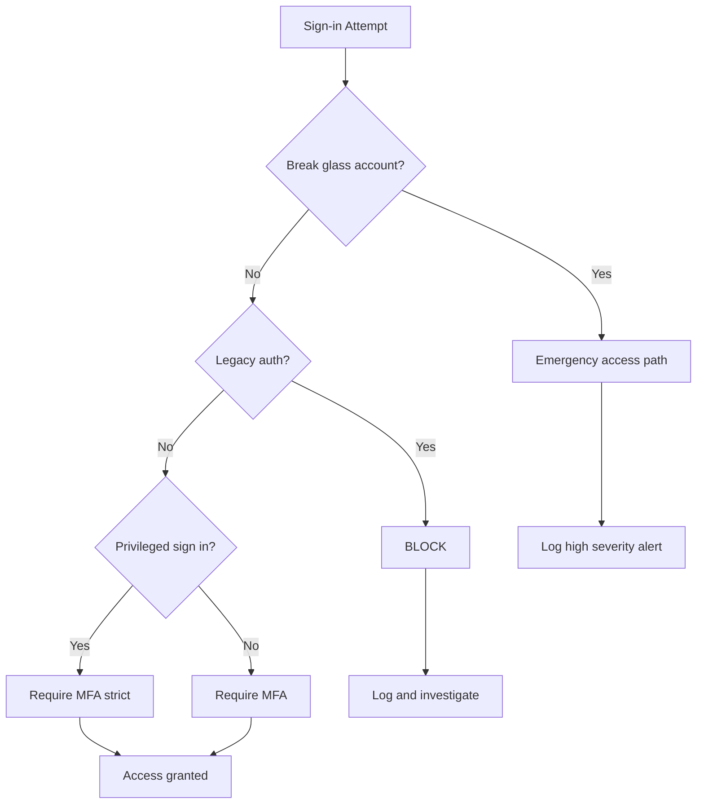

# Conditional Access Baseline (MFA + Break-Glass + Exceptions)

> [!IMPORTANT]
> **Governance Change Policy:** Once marked **COMPLETE**, this baseline is **IMMUTABLE**. Deviations require a documented **Risk Acceptance (RA)** and entry into the **Exception Register**.

---

## Strategic Goal
Establish a defensible Conditional Access (CA) baseline that enforces strong authentication for interactive users, protects privileged identity paths, and governs exceptions explicitly—without introducing hidden bypasses or operational fragility.

This baseline is designed to withstand real-world identity attack patterns and formal audit review.

---

## Visual Logic (Decision Flow)

---

## Governance Decisions
- Break-glass accounts are excluded only from the global MFA policy to preserve emergency access without broad CA bypass.
- Legacy authentication is blocked tenant-wide to eliminate downgrade paths; exceptions require risk acceptance and an expiration date.
- Privileged roles are treated as high-consequence identities and receive stricter enforcement.
- Exceptions are temporary risk decisions with explicit owner and sunset date.

---

## Scope & Non-Goals
| In scope | Out of scope (by design) |
| --- | --- |
| Interactive user authentication | Device compliance enforcement (requires managed endpoint baseline) |
| Privileged role sign-ins | Continuous access evaluation tuning |
| Emergency access governance | App-level sign-in risk policies requiring premium telemetry |
| Exception documentation + review |  |

---

## Operating Baseline
| Item | Standard |
| --- | --- |
| Tenant | Entra ID with Conditional Access |
| MFA | Approved method(s) defined by org |
| Emergency access | Two break-glass accounts |
| Admin identities | Separate admin identities where feasible |

**Baseline objective**
- Enforce MFA where it matters
- Eliminate legacy auth
- Reduce blast radius of privileged compromise
- Make all exceptions visible, reviewable, and reversible

---

## Policy Set (Design)

### Primary Controls
| Policy ID | Policy Name | Target | Grant Control |
| --- | --- | --- | --- |
| CA-01 | Require MFA – All Users | All Users | Require MFA |
| CA-02 | Block Legacy Authentication | All Users | Block |
| CA-03 | Privileged Role Protection | Directory Roles | Require MFA (Strict) |

> [!TIP]
> Implement CA-02 in **Report-only** mode for a short validation window to identify legacy dependencies before enforcement.

### Exception Model
- **Permitted types:** break-glass emergency accounts, service/automation identities (prefer workload identities), scoped B2B partners.
- **Hard requirements:** documented justification, explicit owner, explicit scope, mandatory expiration/review date.

---

## Steps I take (only what matters)
1. Validate emergency access
   - Confirm two break-glass accounts exist
   - Secure credentials offline
   - Exclude from CA-01 only

2. Implement CA-01 (Require MFA – All Users)
   - Include: all users
   - Exclude: break-glass only
   - Grant: require MFA

3. Implement CA-02 (Block legacy authentication)
   - Implement in Report-only for a short validation window
   - Move to Enforced once dependencies are remediated

4. Implement CA-03 (Privileged role protection)
   - Target: directory roles
   - Require MFA consistently for privileged sign-ins

5. Establish exception register
   - Record owner, justification, scope, expiration
   - Align with access review cadence

---

## Audit Tests

### Test of Design
- [ ] Policies exist, are enabled, and match documented scope/exclusions.
- [ ] Break-glass accounts are the only global MFA exclusions.
- [ ] Targeting is complete (e.g., all cloud apps where applicable).

### Test of Effectiveness
- [ ] Sign-in logs show MFA enforced for interactive access.
- [ ] Legacy authentication attempts are blocked.
- [ ] Privileged role sign-ins require MFA consistently.
- [ ] Break-glass sign-ins trigger a high-severity alert (if alerting is configured).

---

## Verification

**Expected**
- MFA prompts occur for interactive sign-ins.
- Legacy authentication attempts show blocked outcomes.
- Privileged sign-ins consistently require MFA.
- Break-glass accounts are used only for emergencies and generate high-signal logging.

**Observed**
- To be captured during implementation and retained in Evidence.

---

## Evidence
Evidence Index: [`./evidence/evidence-index.md`](./evidence/evidence-index.md)

Minimum evidence artifacts:
- EV-YYYY-MM-DD-001 — CA policy list (enabled)
- EV-YYYY-MM-DD-002 — CA-01 config (MFA + break-glass exclusion)
- EV-YYYY-MM-DD-003 — CA-02 legacy auth (report-only → enforce)
- EV-YYYY-MM-DD-004 — Sign-in logs showing MFA applied

---

## Controls Mapped
- NIST 800-53: AC-2, AC-6, IA-2, IA-5, AU-2, AU-12

---

## Navigation
- Repo README: [Home](../README.md)
- Pillar README: [01 — Identity Governance](./README.md)
- Strategy Wrapper: [04 — Strategy](../04_Strategy_Risk_Resilience/README.md)
