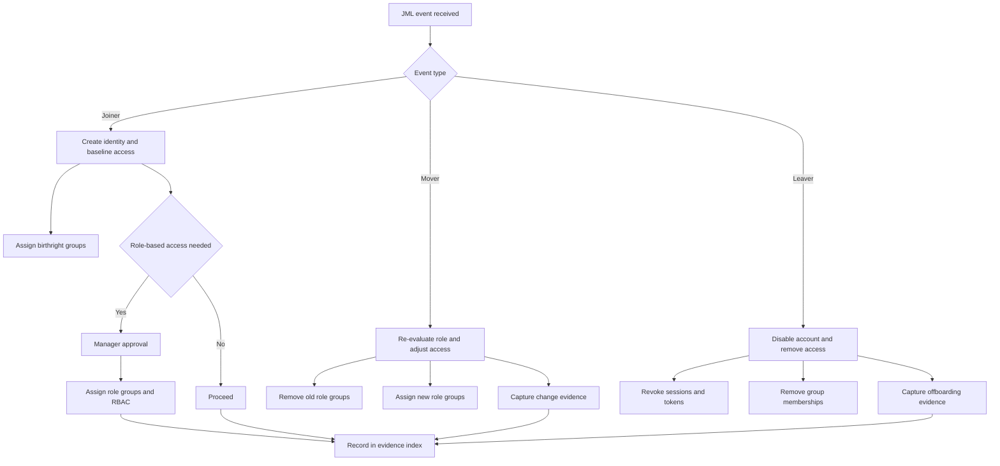

# Join / Move / Leave (JML) Lifecycle Workflow (Approvals + Evidence)

> [!IMPORTANT]
> **Governance Change Policy:** Once marked **COMPLETE**, this workflow is **IMMUTABLE**. Changes require documented justification, approval, and updated evidence.

---

## Strategic Goal
Standardize and govern the identity lifecycle so that every user account follows a controlled process from onboarding through role change and separation—ensuring access is **appropriate, approved, time-bound where required, and fully auditable**.

This workflow is designed to reduce account sprawl, prevent privilege creep, and support consistent audit outcomes.

---

## What This Proves
- I manage identity lifecycle as a governance system, not a helpdesk task.
- I enforce approvals, least privilege, and separation of duties across the JML lifecycle.
- I produce evidence suitable for test of design and test of effectiveness.

---

## Governance Decisions
- All access is group-based (birthright + role-based) with documented owners.
- Movers trigger a mandatory access re-evaluation to prevent privilege creep.
- Leavers trigger immediate access removal with evidence capture.
- Exceptions are time-bound and recorded in an Exception Register.
- High-impact access requires approval and (where applicable) privileged elevation controls.

---

## Scope & Non-Goals
| In scope | Out of scope (by design) |
| --- | --- |
| Employee onboarding and account provisioning | HR policy design |
| Role changes and access adjustments | App-specific entitlements requiring separate systems |
| Separation/offboarding and access removal | Endpoint device recovery process |
| Evidence capture and review | Full IGA platform buildout (future enhancement) |

---

## Operating Baseline
| Item | Standard |
| --- | --- |
| Source of truth | HR trigger or ticketed request (documented) |
| Provisioning model | Group-based access + RBAC mapping |
| Privileged access | PIM model for elevated roles |
| Review cadence | Quarterly access reviews minimum |
| Evidence | Stored and indexed per pack |

---

## Visual Logic (JML Decision Flow)

---

## Approval Model (who approves what)
| Access Category | Examples | Required Approval | Notes |
| --- | --- | --- | --- |
| Birthright access | Email, collaboration baseline | No (standard) | Defined by policy |
| Role-based access | Dept apps, resource groups | Manager + App/Resource Owner | Based on RBAC map |
| Privileged access | Admin roles, RBAC admin | Two-person approval where feasible | Use PIM/JIT |
| Exceptions | Bypass, elevated scope | Risk Acceptance (RA) | Must expire |

---

## Steps I Take (Only What Matters)

### Joiner
1. Validate request source (HR or ticket) and identity attributes.
2. Create account and enforce baseline authentication requirements.
3. Assign standardized birthright groups.
4. Apply role-based access via approved role groups and RBAC scope.
5. Capture evidence (request + assignment export).

### Mover
1. Validate role change trigger and effective date.
2. Remove prior role groups and scoped RBAC assignments.
3. Assign new role groups per RBAC map with required approvals.
4. Capture evidence showing before/after access state.

### Leaver
1. Disable account immediately and revoke active sessions.
2. Remove group memberships and privileged assignments.
3. Confirm data/mailbox handling is routed per policy.
4. Capture evidence with timestamps.

---

## Audit Tests

### Test of Design
- [ ] Documented JML workflow exists with defined approvals.
- [ ] Access is granted via groups with documented ownership.
- [ ] Movers trigger mandatory access re-evaluation.
- [ ] Leavers are deprovisioned promptly and consistently.

### Test of Effectiveness
- [ ] Sample joiners show correct birthright and role access.
- [ ] Sample movers show removal of old access.
- [ ] Sample leavers show timely disablement and access removal.

---

## Verification

**Expected**
- New users receive only birthright plus approved role access.
- Movers do not retain legacy permissions.
- Leavers lose access quickly with evidence retained.

**Observed**
- To be captured during implementation and retained as evidence.

---

## Evidence
Evidence Index: [`./evidence/evidence-index.md`](./evidence/evidence-index.md)

Minimum evidence artifacts:
- EV-YYYY-MM-DD-001 — Joiner request and group assignment export
- EV-YYYY-MM-DD-002 — Mover before/after access comparison
- EV-YYYY-MM-DD-003 — Leaver disablement proof and removal logs
- EV-YYYY-MM-DD-004 — Exception register entry (if applicable)

---

## Controls Mapped
- NIST 800-53: AC-2, AC-5, AC-6, IA-2, AU-2, AU-12

---

## Navigation
- Repo README: [Home](../README.md)
- Pillar README: [01 — Identity Governance](./README.md)
- Related Control: [RBAC Least Privilege Map](./RBAC_Least_Privilege_Map.md)
