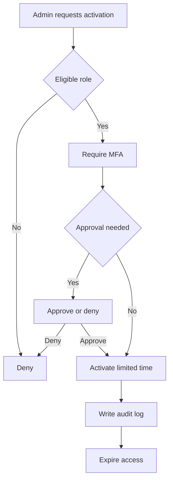

# Privileged Identity Management (PIM) Governance Model

> [!IMPORTANT]
> **Governance Change Policy:** Once marked **COMPLETE**, this model is **IMMUTABLE**. Any exception requires documented Risk Acceptance and expiration.

---

## Strategic Goal
Reduce the blast radius of administrative compromise by enforcing **Just-In-Time (JIT)** access, strong authentication at activation, and full auditability of privileged actions.

This model ensures that **no standing admin access exists without justification, traceability, and expiration**.

---

## What This Proves
- I treat privileged access as a **high-risk business asset**, not a convenience.
- I understand real attack paths involving over-permissioned admins.
- I design controls that satisfy **test of design** and **test of effectiveness**.
- I can explain privileged access to both **engineers and auditors**.

---

## Governance Decisions
- All privileged roles are **eligible**, not permanently active.
- Activation requires MFA and justification.
- Privileged access is time-bound and automatically revoked.
- Emergency access is isolated and monitored separately.
- Logs are retained to support forensic and audit review.

---

## Scope & Non-Goals
| In scope | Out of scope (by design) |
| --- | --- |
| Azure AD / Entra ID directory roles | Azure resource RBAC (covered separately) |
| Global / Security / Privileged roles | Application-level admin roles |
| Activation approvals (where required) | Continuous Access Evaluation tuning |
| Privileged audit logging | Endpoint local admin control |

---

## Operating Baseline
| Item | Standard |
| --- | --- |
| Identity platform | Microsoft Entra ID |
| Privileged access | Azure AD PIM |
| Authentication | MFA required at activation |
| Activation duration | 1–8 hours (role dependent) |
| Emergency access | Separate break-glass accounts |

---

## Privileged Role Model
| Role Category | Example Roles | Governance Rule |
| --- | --- | --- |
| Global Control | Global Admin | Eligible only, approval + MFA |
| Security Control | Security Admin | Eligible, MFA required |
| Identity Control | Privileged Role Admin | Eligible, time-bound |
| Read-only | Global Reader | Eligible, no approval |

---

## Activation Flow (Logic)

---

## Steps I Take (Only What Matters)
1. Enable Privileged Identity Management for directory roles.
2. Convert all standing administrators to **eligible** assignments.
3. Define activation duration per role (based on impact).
4. Require MFA at role activation.
5. Configure approval workflows for high-impact roles.
6. Validate logging and alerting for all activation events.
7. Document exceptions and emergency access usage.

---

## Audit Tests

### Test of Design
- [ ] PIM is enabled for all privileged directory roles.
- [ ] No standing Global Administrators exist.
- [ ] MFA is enforced at role activation.
- [ ] Activation duration limits are configured per role.

### Test of Effectiveness
- [ ] Activation logs show MFA challenge completion.
- [ ] Privileged roles automatically expire at configured duration.
- [ ] Emergency access usage is rare, justified, and logged.

---

## Verification

**Expected**
- Administrators have zero privilege by default.
- Privileged access exists only during approved activation windows.
- All role activations generate audit events.

**Observed**
- To be captured during implementation and retained as evidence.

---

## Evidence
Evidence Index: [`./evidence/evidence-index.md`](./evidence/evidence-index.md)

Minimum evidence artifacts:
- EV-YYYY-MM-DD-001 — PIM role settings (eligible vs active)
- EV-YYYY-MM-DD-002 — Role activation log sample
- EV-YYYY-MM-DD-003 — Privileged role assignment export
- EV-YYYY-MM-DD-004 — Auto-revocation confirmation

---

## Controls Mapped
- NIST 800-53: AC-2, AC-6, IA-2, IA-5, AU-2, AU-12

---

## Navigation
- Repo README: [Home](../README.md)
- Pillar README: [01 — Identity Governance](./README.md)
- Related Control: [Conditional Access Baseline](./Conditional_Access_Baseline.md)
