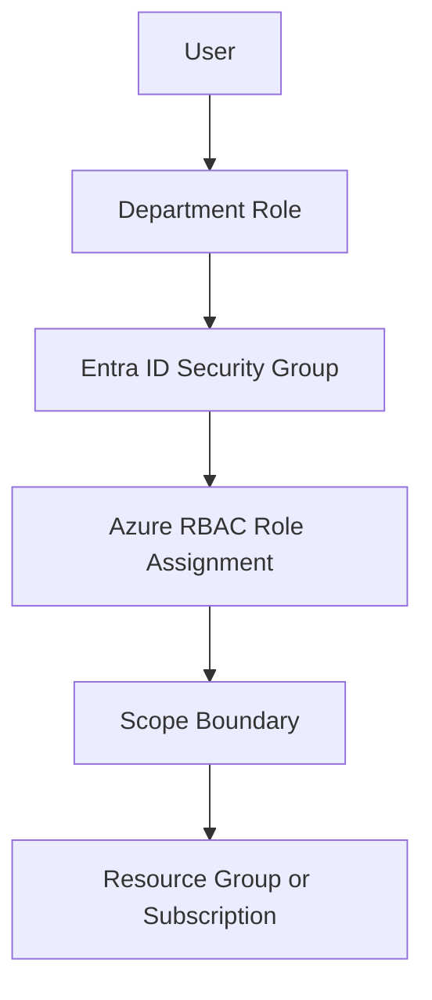

# RBAC Least Privilege Map (Department Roles → Permissions)

> [!IMPORTANT]
> **Governance Change Policy:** Once marked **COMPLETE**, this RBAC model is **IMMUTABLE**. Changes require documented justification, approval, and update to Evidence and Control Mapping.

---

## Strategic Goal
Define and enforce a least-privilege RBAC model that maps business functions to explicit permissions, prevents privilege creep, and supports clean onboarding/offboarding (JML) and access reviews.

This model is designed to be defensible under audit and usable by engineering teams without ambiguity.

---

## What This Proves
- I design permissions from a business function perspective, not ad-hoc individual grants.
- I prevent privilege creep by standardizing “birthright” access per role and enforcing scope boundaries.
- I can demonstrate design intent and operational effectiveness through evidence and review artifacts.

---

## Governance Decisions
- Roles are defined at the **job-function** level (not individual user preferences).
- Access is granted via **groups**, not direct assignment (except break-glass/emergency cases).
- Privileged actions require elevation via PIM and/or separated admin identities.
- RBAC scope follows the principle: **least scope required** (resource group before subscription).

---

## Scope & Non-Goals
| In scope | Out of scope (by design) |
| --- | --- |
| Azure RBAC role assignments | Application-internal roles/permissions |
| Group-based access model | Endpoint local admin permissions |
| Subscription / Resource Group scope boundaries | Fine-grained custom roles (v2 enhancement) |
| Department role mapping | Per-user “special requests” without governance |

---

## Operating Baseline
| Item | Standard |
| --- | --- |
| Authorization model | Azure RBAC + group-based assignments |
| Role assignment method | Groups (Entra ID security groups) |
| Privileged roles | Elevated via PIM where applicable |
| Review cadence | Quarterly access reviews minimum |

---

## Visual Model (how access is granted)

---

## RBAC Role Catalog (baseline)
This repo uses common built-in roles first. Custom roles are a controlled enhancement once the baseline is stable.

| RBAC Role | Intended Use | Notes |
| --- | --- | --- |
| Reader | View-only access | Default for audit/visibility |
| Contributor | Create/manage resources | Not allowed for sensitive platforms without controls |
| User Access Administrator | Manage RBAC assignments | High-risk; restrict strongly |
| Security Reader | Read security posture | Use for security reporting |
| Security Admin | Manage security settings | Require PIM and approvals |
| Key Vault Secrets User | Read secrets (data-plane) | Require strict scoping |

---

## Department Role → Access Map (example baseline)
This is the “birthright” access set. Any deviation must be documented as an exception with expiration.

| Business Role | Group Name | Azure RBAC Role | Scope | Approval Required |
| --- | --- | --- | --- | --- |
| Finance Analyst | GRP-AZ-FIN-READ | Reader | Subscription (Finance) | No |
| Security Analyst | GRP-AZ-SEC-READ | Security Reader | Subscription | No |
| Cloud Engineer | GRP-AZ-ENG-CONTRIB | Contributor | Resource Group (App/Platform) | Yes (Owner) |
| Platform Admin | GRP-AZ-PLAT-ADMIN | Security Admin | Subscription | Yes (CISO/Delegate) |
| RBAC Admin | GRP-AZ-RBAC-ADMIN | User Access Administrator | Subscription | Yes (2-person rule) |

> [!TIP]
> Keep “Contributor” scoped to Resource Groups for most teams. Subscription-wide Contributor is a common audit finding and a frequent root cause of uncontrolled change.

---

## Steps I Take (Only What Matters)
1. Define business roles and their minimum duties (job function level).
2. Create Entra ID security groups per business role (naming standard enforced).
3. Assign Azure RBAC roles to groups at the minimum required scope.
4. Enforce separation for privileged roles (PIM + admin identities).
5. Establish exception process for non-standard access with expiration.
6. Validate effectiveness via access review sampling and assignment exports.

---

## Audit Tests

### Test of Design
- [ ] RBAC role catalog exists and is documented.
- [ ] Access is group-based; direct assignments are restricted and justified.
- [ ] Scope boundaries follow least privilege (RG preferred).
- [ ] High-risk roles require additional governance (approval + PIM).

### Test of Effectiveness
- [ ] Assignment exports show most access is group-based (not direct).
- [ ] Quarterly access reviews identify and remove stale or over-scoped access.
- [ ] High-risk roles show evidence of time-bound elevation (PIM logs).

---

## Verification

**Expected**
- Users receive access through role-based groups aligned to their job function.
- Contributors are scoped to RGs unless explicitly approved.
- High-risk RBAC roles are rare and monitored.

**Observed**
- To be captured during implementation and retained as evidence.

---

## Evidence
Evidence Index: [`./evidence/evidence-index.md`](./evidence/evidence-index.md)

Minimum evidence artifacts:
- EV-YYYY-MM-DD-001 — RBAC assignment export (group-based)
- EV-YYYY-MM-DD-002 — Example group definition + membership view
- EV-YYYY-MM-DD-003 — Scope proof (RG vs subscription assignment)
- EV-YYYY-MM-DD-004 — Exception register entry (if any)

---

## Controls Mapped
- NIST 800-53: AC-2, AC-3, AC-6, AU-2, AU-12

---

## Navigation
- Repo README: [Home](../README.md)
- Pillar README: [01 — Identity Governance](./README.md)
- Related Control: [PIM Governance Model](./PIM_Governance_Model.md)
