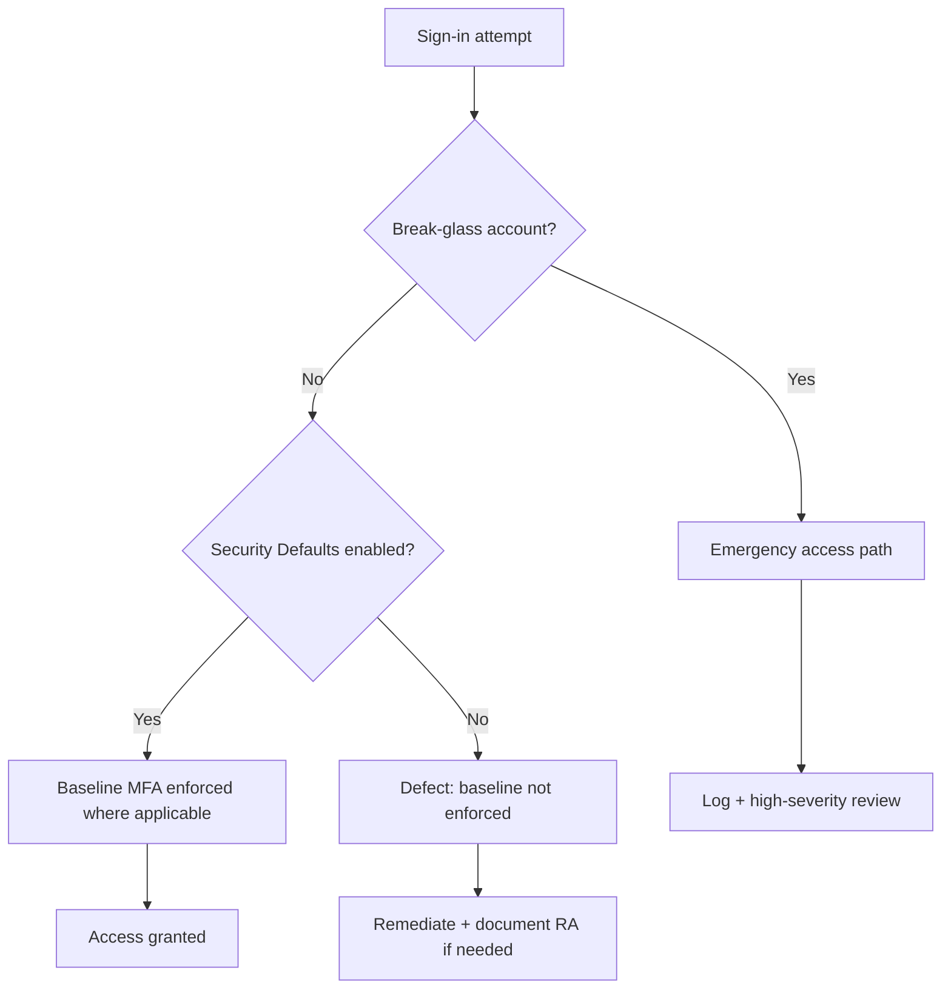

# Conditional Access Baseline (MFA + Break-Glass + Exceptions)

> [!IMPORTANT]
> **Governance Change Policy:** This baseline is **IMMUTABLE**. Deviations require a documented **Risk Acceptance (RA)** and entry into the **Exception Register** (`/EXCEPTION_REGISTER.md`).

---

## Strategic Goal
Establish a defensible authentication enforcement baseline that:
- enforces strong authentication for interactive users,
- preserves a controlled emergency access path (break-glass),
- constrains authentication methods to approved options,
- and provides audit-ready verification using sign-in evidence.

This baseline is designed to withstand real-world identity attack patterns and formal audit review.

---

## Licensing Constraint (Current Tenant State)
This tenant does not have sufficient Microsoft Entra ID Premium licensing to create **Conditional Access** policies.

**Therefore, this baseline is implemented using:**
- **Security Defaults** (baseline MFA posture + recommended protections)
- **Authentication Methods Policy** (method governance)
- **Break-glass accounts** (emergency access governance)
- **Sign-in logs** (verification evidence)

**Gap (documented):**
Conditional Access policy-level targeting (cloud apps, device platform conditions, sign-in risk) is not available in this tenant. Evidence is retained showing the license gate.

---

## What This Proves
- I treat authentication enforcement as a **governance control**, not a UI configuration.
- I preserve emergency access while preventing broad bypass patterns.
- I document a baseline under licensing constraints **without overstating capabilities**.
- I produce evidence suitable for **test of design** and **test of effectiveness**.

---

## Governance Decisions
- Authentication enforcement must be **documented, reviewable, and testable**.
- Emergency access is implemented using **two break-glass accounts**, isolated and monitored.
- Break-glass accounts are governed by strict usage rules and are not used for normal operations.
- Authentication methods are governed using a tenant-level **Authentication Methods Policy**.
- Deviations from baseline controls require **Risk Acceptance** and must expire.

---

## Scope & Non-Goals
| In scope | Out of scope (by design) |
| --- | --- |
| Baseline MFA posture via Security Defaults | Conditional Access policy creation (license-gated) |
| Break-glass governance | Risk-based CA controls (sign-in risk / user risk) |
| Authentication Methods Policy | Device compliance enforcement (Intune-dependent) |
| Sign-in log verification | Continuous Access Evaluation tuning |

---

## Operating Baseline
| Item | Standard |
| --- | --- |
| Identity platform | Microsoft Entra ID |
| Baseline enforcement | Security Defaults (tenant-level) |
| Method governance | Authentication Methods Policy |
| Emergency access | Two break-glass accounts |
| Verification source | Sign-in logs (Entra ID) |
| Evidence retention | Per repo evidence standards |

---

## Visual Logic (Decision Flow)

---

## Control Set (Design)
| Control Area | Baseline Control | Implementation (this tenant) |
| --- | --- | --- |
| MFA enforcement | Require MFA for interactive sign-ins where applicable | Security Defaults |
| Emergency access | Maintain controlled break-glass path | Two break-glass accounts + governance rules |
| Method governance | Restrict/approve authentication methods | Authentication Methods Policy |
| Verification | Prove enforcement is observable | Sign-in logs + authentication details |

---

## Audit Tests

### Test of Design (control exists as designed)
- [x] Evidence that Conditional Access policy creation is license-gated (no Entra ID Premium).
- [x] Security Defaults status is visible and enabled.
- [x] Authentication Methods Policy exists and is configured.
- [x] Two break-glass accounts exist and are identifiable.
- [x] Break-glass accounts have privileged assignment documented.

### Test of Effectiveness (control works in practice)
- [x] Interactive sign-ins are captured in Entra sign-in logs.
- [x] Authentication enforcement is observable in sign-in “Authentication Details”.
- [x] “Previously satisfied” / MFA state is observable (expected in non-CA tenants depending on session + method).
- [x] Break-glass usage is reviewable via sign-in telemetry (manual review in this tenant; SIEM alerting is handled in Logging Baseline pack).

---

## Evidence (linked)

| Evidence ID | Artifact | What it proves |
| --- | --- | --- |
| EV-2026-01-17-001 | [CA license gate](./evidence/EV-2026-01-17-001_ca_license_gate.png) | Conditional Access policy creation is license-gated (no Entra ID Premium) |
| EV-2026-01-17-002 | [Security Defaults enabled](./evidence/EV-2026-01-17-002_security_defaults_enabled.png) | Baseline MFA posture is enabled via Security Defaults |
| EV-2026-01-17-003 | [Authentication Methods Policy](./evidence/EV-2026-01-17-003_auth_methods_policy.png) | Method governance exists and is configurable |
| EV-2026-01-17-004 | [Break-glass accounts exist](./evidence/EV-2026-01-17-004_breakglass_accounts_exist.png) | Two break-glass identities exist (emergency access path) |
| EV-2026-01-17-005 | [Break-glass Global Admin assignment](./evidence/EV-2026-01-17-005_breakglass_global_admin.png) | Break-glass identities are privileged (directory-level) |
| EV-2026-01-17-006 | [Sign-in log visibility](./evidence/EV-2026-01-17-006_signin_visibility_basic.png) | Sign-in logs are available and reviewable |
| EV-2026-01-17-007 | [MFA registration reporting gate](./evidence/EV-2026-01-17-007_mfa_registration_report.png) | MFA registration reporting is premium-gated (documented constraint) |
| EV-2026-01-17-008 | [User authentication methods](./evidence/EV-2026-01-17-008_user_authentication_methods.png) | MFA-related methods exist; TAP presence shows operational capability |
| EV-2026-01-17-009 | [Sign-in authentication details](./evidence/EV-2026-01-17-009_signin_event_auth_details_mfa.png) | Enforcement state is observable in telemetry (“Previously satisfied” / auth details) |

---

## Exception Handling
Any exception (e.g., disabling Security Defaults, adding unusual auth methods, break-glass used outside emergency) requires:
- documented justification
- explicit scope (who/what)
- expiration date
- entry into: `/EXCEPTION_REGISTER.md`

---

## Controls Mapped (NIST 800-53)
- IA-2 (Identification and Authentication)
- AC-2 (Account Management)
- AC-6 (Least Privilege)
- AU-2 / AU-12 (Audit Events / Audit Record Generation)

---

## Navigation
- Repo README: `../README.md`
- Pillar README: `./README.md`
- Evidence index: `./evidence/evidence-index.md`
- Exception register: `../EXCEPTION_REGISTER.md`
