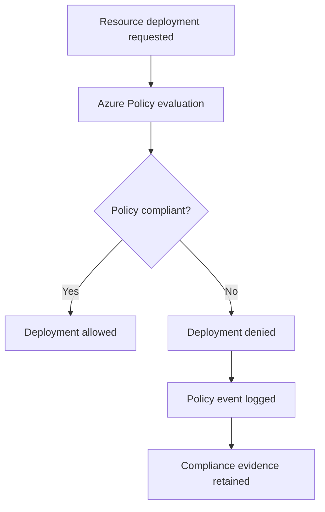

# Azure Policy Guardrails (Preventative Controls + Compliance Evidence)

> [!IMPORTANT]
> **Governance Change Policy:** Once marked **COMPLETE**, these guardrails are **IMMUTABLE**. Changes require documented justification, approval, and updated compliance evidence.

---

## Strategic Goal
Enforce a small, high-impact set of **preventative Azure Policy guardrails** that block unsafe configurations *before* deployment and provide continuous compliance evidence for audit review.

This pack demonstrates how governance is enforced **by design**, not retroactively corrected.

---

## What This Proves
- I use Azure Policy as a **control mechanism**, not a reporting tool.
- I prioritize preventative enforcement over detective cleanup.
- I select guardrails based on **risk reduction**, not policy sprawl.
- I generate compliance evidence that supports test of design and effectiveness.

---

## Governance Decisions
- Policies are scoped as narrowly as possible (RG before subscription).
- High-risk misconfigurations are **Denied**, not audited.
- Exceptions require documented Risk Acceptance with expiration.
- Policy compliance is reviewed on a defined cadence.
- Policy assignments are version-controlled and documented.

---

## Scope & Non-Goals
| In scope | Out of scope (by design) |
| --- | --- |
| Azure Policy built-in / initiative definitions | Custom policy authoring (v2 enhancement) |
| Preventative deny controls | Advisory-only audit policies |
| Compliance evidence | Third-party policy engines |
| Azure resources | Application runtime security |

---

## Operating Baseline
| Item | Standard |
| --- | --- |
| Policy engine | Azure Policy |
| Assignment scope | Subscription or Resource Group |
| Enforcement mode | Deny (where applicable) |
| Review cadence | Monthly |
| Evidence | Policy compliance exports |

---

## Visual Logic (Policy Enforcement Flow)

---

## Core Guardrails (Baseline Set)
This baseline intentionally limits guardrails to the highest ROI controls.

| Guardrail ID | Control Objective | Enforcement |
| --- | --- | --- |
| AP-01 | Require resource tagging | Deny |
| AP-02 | Restrict deployment regions | Deny |
| AP-03 | Enforce secure storage access | Deny |
| AP-04 | Require diagnostics and logging | Deny |
| AP-05 | Prevent public exposure | Deny |

---

## Guardrail Details

### AP-01 — Required Resource Tags
- Enforces Cost Center, Owner, and Application tags.
- Prevents untracked and orphaned resources.

### AP-02 — Allowed Azure Regions
- Restricts deployments to approved regions only.
- Reduces data residency and compliance risk.

### AP-03 — Secure Storage Configuration
- Blocks public access on storage accounts.
- Enforces secure defaults at creation time.

### AP-04 — Diagnostic Logging Required
- Requires diagnostics to be enabled for supported resources.
- Ensures security and audit visibility.

### AP-05 — No Public Network Exposure
- Prevents public endpoints on sensitive services.
- Forces use of private endpoints or controlled ingress.

---

## Steps I Take (Only What Matters)
1. Select built-in policies aligned to the risk objectives.
2. Assign policies at the minimum required scope.
3. Configure parameters to enforce enterprise standards.
4. Validate deny behavior using controlled test deployments.
5. Capture policy assignment and compliance evidence.
6. Track exceptions through formal Risk Acceptance.

---

## Audit Tests

### Test of Design
- [ ] Policy guardrails are documented and approved.
- [ ] Deny effects are used for high-risk controls.
- [ ] Scope and parameters align to stated objectives.
- [ ] Exception process is documented.

### Test of Effectiveness
- [ ] Non-compliant deployments are blocked.
- [ ] Policy events appear in activity logs.
- [ ] Compliance reports reflect enforced controls.
- [ ] Exceptions show approval and expiration.

---

## Verification

**Expected**
- Unsafe configurations are blocked at deployment time.
- Compliance posture is measurable and consistent.
- Exceptions are rare and time-bound.

**Observed**
- To be captured during implementation and retained as evidence.

---

## Evidence
Evidence Index: [`./evidence/evidence-index.md`](./evidence/evidence-index.md)

Minimum evidence artifacts:
- EV-YYYY-MM-DD-001 — Policy assignment configuration
- EV-YYYY-MM-DD-002 — Denied deployment attempt
- EV-YYYY-MM-DD-003 — Compliance report export
- EV-YYYY-MM-DD-004 — Exception approval (if applicable)

---

## Controls Mapped
- NIST 800-53: AC-3, CM-2, CM-6, IA-7, RA-5

---

## Navigation
- Repo README: [Home](../README.md)
- Pillar README: [02 — Cloud Guardrails](./README.md)
- Related Controls:
  - [Defender for Cloud Baseline](./Defender_Remediation_Plan.md)
  - [Logging Baseline](./Logging_&_KQL_Library.md)
