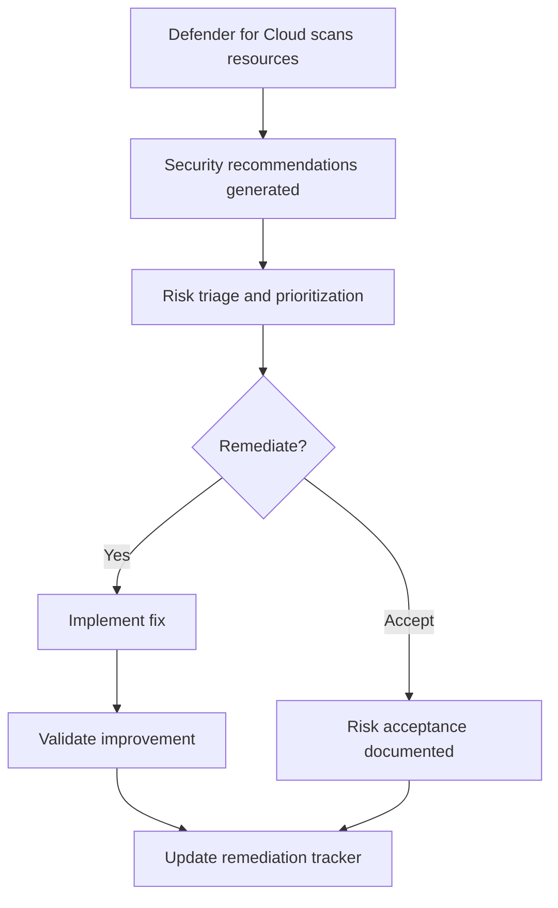

# Defender for Cloud Baseline & Remediation Tracker

> [!IMPORTANT]
> **Governance Change Policy:** Once marked **COMPLETE**, this baseline is **IMMUTABLE**. Changes require documented justification, approval, and updated remediation evidence.

---

## Strategic Goal
Establish a standardized cloud security posture baseline using Microsoft Defender for Cloud, then track remediation actions in a way that is **measurable, auditable, and repeatable**.

This pack demonstrates how security findings are converted into **governed remediation outcomes**, not ignored alerts.

---

## What This Proves
- I understand cloud security posture management (CSPM) beyond dashboards.
- I can translate security recommendations into actionable remediation plans.
- I track security improvement over time using evidence, not screenshots alone.
- I design controls that support both operational security and audit review.

---

## Governance Decisions
- Defender for Cloud is the authoritative source for posture findings.
- Recommendations are triaged by **risk and exploitability**, not raw count.
- Remediation actions are tracked with owner, status, and evidence.
- Accepted risks require formal Risk Acceptance (RA) with expiration.
- Security score improvement is monitored, not gamed.

---

## Scope & Non-Goals
| In scope | Out of scope (by design) |
| --- | --- |
| Azure Defender for Cloud posture | Third-party CSPM tools |
| Secure Score recommendations | Custom threat hunting |
| Remediation tracking | Fully automated SOAR playbooks |
| Evidence retention | Penetration testing |

---

## Operating Baseline
| Item | Standard |
| --- | --- |
| CSPM platform | Microsoft Defender for Cloud |
| Scope | Subscription-level (expandable) |
| Review cadence | Monthly minimum |
| Ownership | Security / Cloud Governance |
| Evidence | Stored per remediation item |

---

## Visual Logic (Posture → Remediation Flow)

---

## Baseline Configuration
- Defender for Cloud enabled at the subscription level.
- Microsoft Cloud Security Benchmark applied.
- Continuous export of recommendations enabled (where applicable).
- Alert severity and categories reviewed and tuned.

---

## Remediation Tracker (Core Artifact)
Each security recommendation is tracked using a structured remediation record.

| Field | Description |
| --- | --- |
| Recommendation ID | Defender for Cloud reference |
| Resource scope | Subscription / Resource Group / Resource |
| Risk level | High / Medium / Low |
| Action | Remediate or Accept |
| Owner | Team or individual |
| Target date | Remediation or review deadline |
| Evidence | Link to proof artifact |

---

## Steps I Take (Only What Matters)
1. Enable Defender for Cloud and confirm resource coverage.
2. Capture initial security recommendations.
3. Triage findings based on exploitability and impact.
4. Assign remediation owners and target dates.
5. Implement fixes or document accepted risks.
6. Validate security score movement.
7. Capture evidence and update remediation tracker.

---

## Audit Tests

### Test of Design
- [ ] Defender for Cloud is enabled and scoped appropriately.
- [ ] Security recommendations are reviewed on a defined cadence.
- [ ] Remediation and risk acceptance paths are documented.
- [ ] Ownership and timelines are defined.

### Test of Effectiveness
- [ ] Sample recommendations show completed remediation.
- [ ] Accepted risks include approval and expiration.
- [ ] Security score improves over time.
- [ ] Evidence supports remediation claims.

---

## Verification

**Expected**
- Clear visibility into cloud security posture.
- High-risk findings are addressed first.
- Remediation actions are traceable and auditable.

**Observed**
- To be captured during execution and retained as evidence.

---

## Evidence
Evidence Index: [`./evidence/evidence-index.md`](./evidence/evidence-index.md)

Minimum evidence artifacts:
- EV-YYYY-MM-DD-001 — Defender for Cloud baseline configuration
- EV-YYYY-MM-DD-002 — Initial recommendation export
- EV-YYYY-MM-DD-003 — Remediation tracker entry
- EV-YYYY-MM-DD-004 — Post-remediation validation

---

## Controls Mapped
- NIST 800-53: CM-2, CM-6, RA-5, SI-2, SI-4

---

## Navigation
- Repo README: [Home](../README.md)
- Pillar README: [02 — Cloud Guardrails](./README.md)
- Related Control: [Azure Policy Guardrails](./Azure_Policy_Definitions.json)
