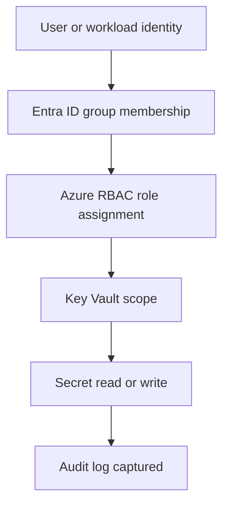

# Key Vault Access Model (RBAC + Secret Access Proof)

> [!IMPORTANT]
> **Governance Change Policy:** Once marked **COMPLETE**, this access model is **IMMUTABLE**. Changes require documented justification, approval, and updated access evidence.

---

## Strategic Goal
Protect secrets, keys, and certificates by enforcing a least-privilege Key Vault access model using **Azure RBAC**, with auditable proof of who accessed what and when.

This pack is designed to prevent secret sprawl, uncontrolled access, and “shared admin” patterns that break audit defensibility.

---

## What This Proves
- I secure secrets using identity-first controls (RBAC) instead of ad-hoc access.
- I apply least privilege to a high-consequence service (Key Vault).
- I design access so that auditors can verify both intent (design) and reality (logs).
- I prevent common failure modes: shared accounts, broad secret permissions, missing audit trails.

---

## Governance Decisions
- Key Vault uses **Azure RBAC**, not Vault access policies (unless required by legacy).
- Access is **group-based**, not directly assigned to users.
- Privileged access paths are time-bound via PIM where applicable.
- Break-glass access is isolated, monitored, and used only for emergencies.
- Access evidence (logs) is retained according to the logging baseline.

---

## Scope & Non-Goals
| In scope | Out of scope (by design) |
| --- | --- |
| Secret/Key/Cert access governance | App code changes or secret rotation automation |
| RBAC role assignments | HSM and advanced key management features |
| Logging and evidence | Full enterprise PKI architecture |
| Break-glass governance | Endpoint credential vaulting |

---

## Operating Baseline
| Item | Standard |
| --- | --- |
| Authorization model | Azure RBAC for Key Vault |
| Assignment method | Entra ID security groups |
| Privileged control | PIM for elevated roles (where used) |
| Logging | Diagnostic settings to Log Analytics |
| Review cadence | Quarterly access reviews minimum |

---

## Visual Model (How access is granted)

---

## Role Model (Baseline)
| Role Category | Recommended Role | Allowed Actions | Notes |
| --- | --- | --- | --- |
| Read secrets | Key Vault Secrets User | Get/List secrets | Default for applications |
| Write secrets | Key Vault Secrets Officer | Set/Delete secrets | Restricted to ops/security |
| Manage vault | Key Vault Administrator | Full control | PIM-only, rare usage |
| Read metadata | Reader | View resource | No secret access |

---

## Control Requirements
- No direct user assignments for secret access (group-only).
- No standing administrative access without time-bound elevation.
- Read and write permissions are separated to enforce separation of duties (SoD).
- Break-glass access triggers high-severity alerting.
- All secret access events must be logged and queryable.

---

## Steps I Take (Only What Matters)
1. Enable RBAC authorization model on the Key Vault.
2. Create Entra ID security groups aligned to the role model.
3. Assign RBAC roles at the Key Vault scope only.
4. Enable diagnostic settings to Log Analytics Workspace.
5. Validate access paths:
   - Authorized identities can retrieve secrets.
   - Unauthorized identities are denied.
6. Capture access events as evidence.
7. Include Key Vault access in quarterly access reviews.

---

## Audit Tests

### Test of Design
- [ ] Key Vault uses Azure RBAC (not access policies).
- [ ] Role assignments align to documented groups.
- [ ] Admin roles are restricted and time-bound.
- [ ] Diagnostic logging is enabled and retained.

### Test of Effectiveness
- [ ] Authorized secret access appears in logs.
- [ ] Unauthorized access attempts are denied and logged.
- [ ] Write access is limited and traceable.
- [ ] Access reviews confirm continued appropriateness.

---

## Verification
**Expected**
- Secrets accessible only by approved roles.
- Administrative access is rare and controlled.
- All access is auditable.

**Observed**
- Captured during execution and retained as evidence.

---

## Evidence
Evidence Index: `./evidence/evidence-index.md`

Minimum artifacts:
- EV-YYYY-MM-DD-001 — Key Vault RBAC configuration
- EV-YYYY-MM-DD-002 — Role assignment list (sanitized)
- EV-YYYY-MM-DD-003 — Successful secret access (log proof)
- EV-YYYY-MM-DD-004 — Denied secret access attempt (log proof)

---

## Controls Mapped
- NIST 800-53: AC-2, AC-6, AU-2, AU-12, SC-28

---

## Navigation
- Repo README: `../README.md`
- Pillar README: `./README.md`
- Related Controls:
  - `./Logging_&_KQL_Library.md`
  - `../01_IGA_Framework/PIM_Governance_Model.md`
