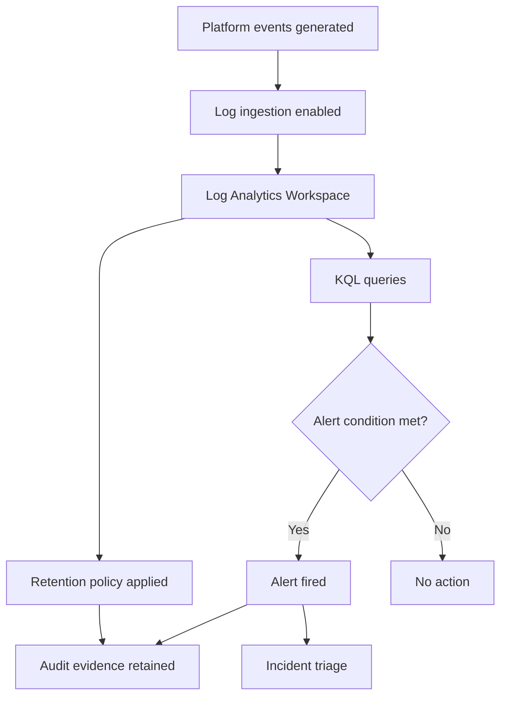

# Logging Baseline (Workspace + Retention + Alerts)


> [!IMPORTANT]
> **Governance Change Policy:** Once marked **COMPLETE**, this logging baseline is **IMMUTABLE**. Changes require documented justification, approval, and updated evidence.

---

## Strategic Goal
Implement a standardized logging baseline that ensures critical identity and cloud control-plane activity is captured, retained, and queryable for detection, incident response, and audit review.

This baseline ensures that investigations are evidence-driven and that key security events are not lost to short retention or missing data sources.

---

## What This Proves
- I design logging for operational security and audit defensibility.
- I understand what to log (and why), not just how to create a workspace.
- I implement retention controls that support investigations and compliance.
- I can produce evidence of log ingestion, retention configuration, and alerting.

---

## Governance Decisions
- A Log Analytics Workspace (LAW) is the centralized collection point for control-plane logs.
- Retention is defined intentionally (not default) and reviewed periodically.
- Alerts are created for high-consequence identity events and critical policy failures.
- Access to logs is least-privilege and monitored.
- Logging exceptions require Risk Acceptance and expiration.

---

## Scope & Non-Goals
| In scope | Out of scope (by design) |
| --- | --- |
| Log Analytics Workspace baseline | Full SIEM content engineering |
| Azure Activity / Entra sign-in logs | Advanced UEBA tuning |
| Retention governance | Full long-term archive solution (v2) |
| Core alert rules | Complete SOC detection catalog |

---

## Operating Baseline
| Item | Standard |
| --- | --- |
| Central log store | Log Analytics Workspace |
| Core sources | AzureActivity, Entra sign-in/audit (where available) |
| Retention | 30–180 days baseline (org dependent) |
| Alerting | High-impact events + policy failures |
| Evidence | Ingestion proof + retention settings + alert rules |

---

## Visual Logic (Collection → Detection → Evidence)


---

## Baseline Log Sources
| Source | Purpose | Evidence |
| --- | --- | --- |
| Azure Activity Log (AzureActivity) | Control-plane changes (who/what/when) | Table populated in LAW |
| Entra Sign-in Logs | Authentication events, MFA enforcement | Sign-in log queries |
| Entra Audit Logs | Directory changes (roles, groups, apps) | Audit log queries |
| Defender for Cloud Alerts (optional) | Security posture findings | Alert records |

---

## Retention Standard
Retention is set intentionally to balance investigation needs and cost.

| Log Type | Baseline Retention | Rationale |
| --- | --- | --- |
| Activity logs | 90 days | Change reconstruction |
| Sign-in logs | 90 days | Credential attack analysis |
| Audit logs | 180 days | Identity governance traceability |
| Alerts | 180 days | Post-incident review |

> Retention is reviewed quarterly and adjusted via formal change control.

---

## Alert Baseline (High-Value Signals)
| Alert ID | Signal | Purpose |
| --- | --- | --- |
| AL-01 | Break-glass sign-in | Emergency access monitoring |
| AL-02 | Legacy authentication attempt | Downgrade attack detection |
| AL-03 | Privileged role activation | JIT admin elevation monitoring |
| AL-04 | Policy deny events | Misconfiguration attempts |
| AL-05 | Excessive failed sign-ins | Credential stuffing detection |

---

## KQL Library (Starter Queries)

### Break-glass Sign-ins
```kql
SigninLogs
| where UserPrincipalName contains "breakglass"
| project TimeGenerated, UserPrincipalName, AppDisplayName, IPAddress, ResultType
| sort by TimeGenerated desc
```

---

### Legacy Authentication Attempts
```kql
SigninLogs
| where ClientAppUsed in ("IMAP4","POP3","SMTP","Other clients")
| project TimeGenerated, UserPrincipalName, ClientAppUsed, IPAddress, ResultType
| sort by TimeGenerated desc
```

---

### Privileged Role Activity 
```kql
AuditLogs
| where OperationName has_any ("Add member to role","Activate eligible role")
| project TimeGenerated, OperationName, InitiatedBy, TargetResources
| sort by TimeGenerated desc
```

---

## Steps I Take (Only What Matters)
1. Create or select a central Log Analytics Workspace.
2. Enable diagnostic settings for required control-plane and identity sources.
3. Configure explicit retention periods (do not rely on defaults).
4. Deploy high-value alert rules aligned to identity and governance risk.
5. Validate ingestion and retention using KQL queries.
6. Restrict access to logs using least-privilege RBAC.
7. Capture configuration state and query output as evidence.

---

## Audit Tests

### Test of Design
- [ ] A centralized Log Analytics Workspace exists and is documented.
- [ ] Required log sources are enabled and scoped correctly.
- [ ] Retention settings meet or exceed baseline requirements.
- [ ] Alert rules are defined for high-risk events.

### Test of Effectiveness
- [ ] Queries return expected data for recent events.
- [ ] Alerts trigger when test conditions are met.
- [ ] Retention settings are enforced and verifiable.
- [ ] Access to logs is limited and reviewable.

---

## Verification

**Expected**
- Identity and control-plane events are consistently ingested.
- Logs are retained long enough to support investigations and audits.
- Alerts fire for high-severity identity and policy events.

**Observed**
- To be captured during execution and retained as evidence.

---

## Evidence
Evidence Index: `./evidence/evidence-index.md`

Minimum evidence artifacts:
- EV-YYYY-MM-DD-001 — Workspace configuration and retention settings
- EV-YYYY-MM-DD-002 — Diagnostic settings enabled (screenshots or export)
- EV-YYYY-MM-DD-003 — KQL query results (sanitized)
- EV-YYYY-MM-DD-004 — Alert rule configuration and test trigger

---

## Controls Mapped
- NIST 800-53: AU-2, AU-6, AU-12, SI-4, IR-5

---

## Navigation
- Repo README: `../README.md`
- Pillar README: `./README.md`
- Related Controls:
  - `../01_IGA_Framework/Conditional_Access_Baseline.md`
  - `./Defender_Remediation_Plan.md`

