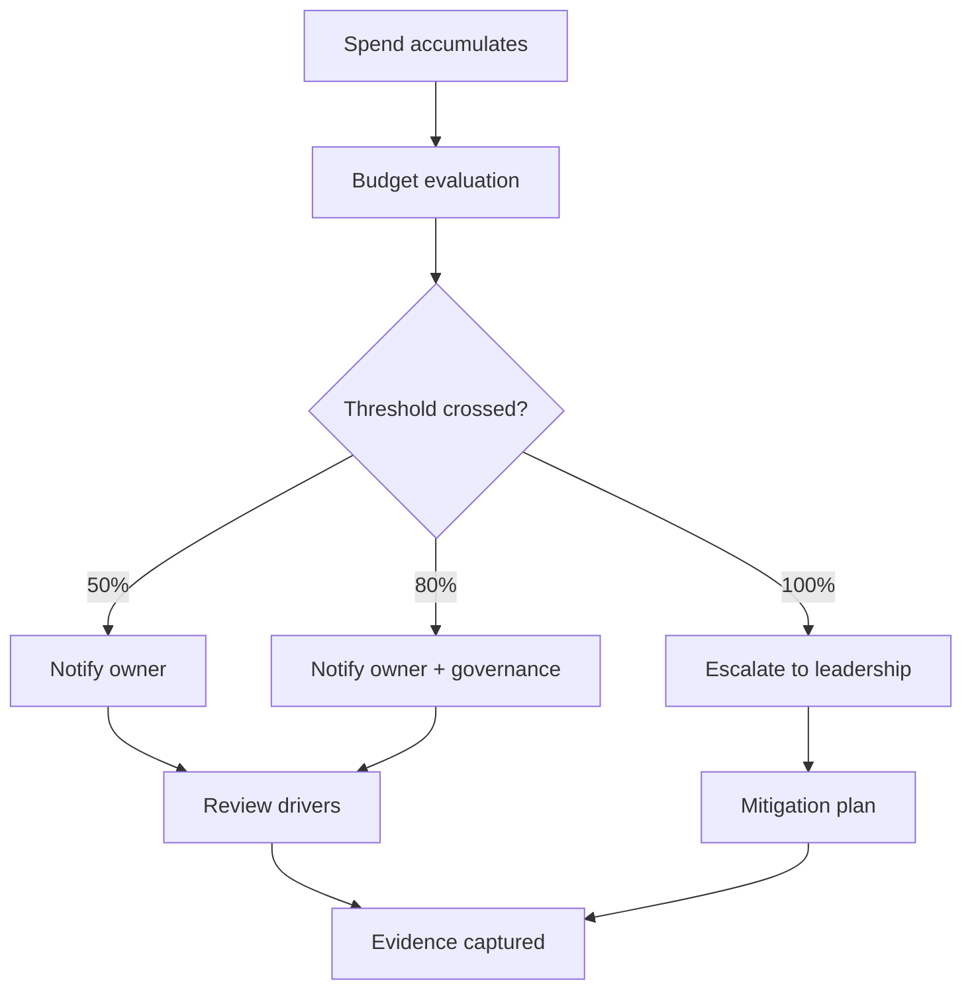

# Budgets + Alerts (Per Team)

> [!IMPORTANT]
> **Governance Change Policy:** Once marked **COMPLETE**, this budget model is **IMMUTABLE**. Any change requires documented justification, approval, and updated notification evidence.

---

## Strategic Goal
Establish a repeatable budget and alerting standard that assigns spend accountability to teams, detects overrun risk early, and produces auditable evidence of proactive cost governance.

This pack is designed to prevent “month-end surprise” spend and to support executive reporting through consistent thresholds and ownership.

---

## What This Proves
- I implement budgets as a governance control, not a finance-only task.
- I align cloud spend to organizational ownership (teams/cost centers).
- I design early warning thresholds that drive action, not noise.
- I produce evidence that budgets exist, alerts fire, and actions are tracked.

---

## Governance Decisions
- Budgets are defined per team / cost center boundary.
- Thresholds use a consistent 3-tier model (early warning → escalation → breach).
- Notifications go to both operational owners and governance stakeholders.
- Budget exceptions require documented Risk Acceptance with expiration.
- Forecast variance is reviewed monthly (paired with showback).

---

## Scope & Non-Goals
| In scope | Out of scope (by design) |
| --- | --- |
| Azure cost budgets per team | Full chargeback billing integration |
| Alert thresholds and routing | Advanced anomaly detection (v2) |
| Evidence capture | Automated ticket creation (v2) |
| Monthly governance review | Vendor-specific budgeting tools |

---

## Operating Baseline
| Item | Standard |
| --- | --- |
| Budget scope | Subscription, RG, or Management Group |
| Budget period | Monthly (default), Quarterly (exec) |
| Thresholds | 50% / 80% / 100% |
| Notification | Email/Action Group distribution |
| Evidence | Budget config + alert history |

---

## Budget Model (Per Team)
| Team / Cost Center | Scope Boundary | Budget Type | Owner |
| --- | --- | --- | --- |
| CC-1001 (Platform) | Mgmt Group / Subscription | Monthly | platform-ops@ |
| CC-2002 (App Team A) | Resource Group | Monthly | appteam-a@ |
| CC-3003 (Security) | Subscription | Monthly | cloud-security@ |

---

## Threshold Standard
| Threshold | Trigger | Required Action |
| --- | --- | --- |
| 50% | Early warning | Validate expected spend, confirm owner |
| 80% | Escalation | Identify drivers, implement corrective actions |
| 100% | Breach | Notify leadership, document mitigation plan |

---

## Visual Logic (Budget Alert Flow)

---

## Steps I Take (Only What Matters)
1. Define budget scope aligned to cost center or team boundary.
2. Create budgets using the standard period and threshold model.
3. Configure notifications to shared distribution lists or action groups.
4. Validate alert delivery using controlled spend or test thresholds.
5. Record alert history and response actions.
6. Review budget status monthly alongside showback reporting.
7. Track exceptions through Risk Acceptance with defined expiration.

---

## Audit Tests

### Test of Design
- [ ] Budgets exist for each defined team or cost center.
- [ ] Thresholds follow the approved 3-tier standard.
- [ ] Notifications route to operational and governance owners.
- [ ] Exception handling process is documented.

### Test of Effectiveness
- [ ] Alerts trigger when thresholds are crossed.
- [ ] Notifications are received by intended recipients.
- [ ] Response actions are documented and traceable.
- [ ] Exceptions are reviewed and time-bound.

---

## Verification

**Expected**
- Teams receive early warning of spend trends.
- Escalation occurs before material overruns.
- Budget governance is consistent and auditable.

**Observed**
- Captured during execution and retained as evidence.

---

## Evidence
Evidence Index: `./evidence/evidence-index.md`

Minimum artifacts:
- EV-YYYY-MM-DD-001 — Budget configuration (scope + thresholds)
- EV-YYYY-MM-DD-002 — Alert notification proof
- EV-YYYY-MM-DD-003 — Alert history export
- EV-YYYY-MM-DD-004 — Documented mitigation or response

---

## Controls Mapped
- FinOps Framework: Budgeting, Forecasting, Governance

---

## Navigation
- Repo README: `../README.md`
- Pillar README: `./README.md`
- Related Packs:
  - `./Tagging_Allocation_Standard.md`
  - `./Monthly_Showback_Template.md`
