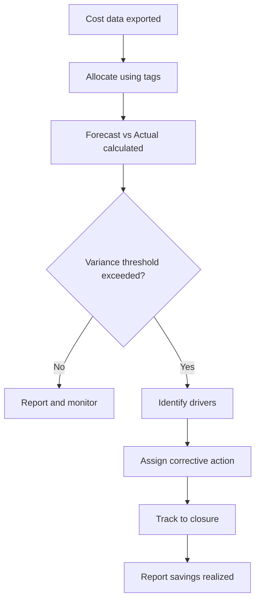

# Showback Template (Forecast vs Actual)

> [!IMPORTANT]
> **Governance Change Policy:** Once marked **COMPLETE**, this showback model is **IMMUTABLE**. Any structural change requires documented justification and updated reporting evidence.

---

## Strategic Goal
Provide a consistent monthly showback report that ties cloud spend to cost centers, applications, and owners, and measures performance using **Forecast vs Actual** variance.

This pack demonstrates disciplined cost governance through executive-ready reporting, not raw billing exports.

---

## What This Proves
- I translate cloud cost into executive language (variance, drivers, accountability).
- I can produce repeatable reporting aligned to ownership and allocation standards.
- I can identify and communicate material cost drivers and corrective actions.
- I can support audit defensibility with stable reporting methods and evidence retention.

---

## Governance Decisions
- Showback is produced on a fixed monthly cadence.
- Every line item must map to CostCenter + Application + Owner.
- Variance thresholds are defined and actioned (not observed passively).
- Exceptions (unallocated spend) are treated as defects and tracked to closure.
- Savings actions are reported with expected vs realized outcomes.

---

## Scope & Non-Goals
| In scope | Out of scope (by design) |
| --- | --- |
| Forecast vs Actual variance reporting | Full chargeback invoicing |
| Cost driver narrative + action tracking | Advanced unit economics models (v2) |
| Allocation mapping from tags | Vendor tool comparison reporting |
| Executive summary format | Real-time anomaly detection |

---

## Operating Baseline
| Item | Standard |
| --- | --- |
| Reporting cadence | Monthly |
| Data sources | Azure Cost Management exports + tags |
| Allocation keys | CostCenter, Application, Owner |
| Variance thresholds | ±5% (watch), ±10% (action) |
| Evidence | Report + export snapshot + notes |

---

## Report Structure (Executive Format)
### Executive Summary (1 page)
| Item | Value |
| --- | --- |
| Total Cloud Spend (Actual) | $X |
| Forecast | $Y |
| Variance ($) | $X - $Y |
| Variance (%) | (X-Y)/Y |
| Top 3 Drivers | Driver A, B, C |
| Corrective Actions | Action 1, 2, 3 |

### Allocation Summary (by Cost Center)
| CostCenter | Forecast | Actual | Variance ($) | Variance (%) | Owner |
| --- | ---: | ---: | ---: | ---: | --- |
| CC-1001 | $ | $ | $ | % | platform-ops@ |
| CC-2002 | $ | $ | $ | % | appteam-a@ |
| CC-3003 | $ | $ | $ | % | cloud-security@ |

### Detail (Top Drivers)
| Driver | Service | CostCenter | Root Cause | Corrective Action | Due Date |
| --- | --- | --- | --- | --- | --- |
| Compute spike | Virtual Machines | CC-2002 | Oversized VM | Rightsizing | YYYY-MM-DD |
| Storage growth | Storage | CC-1001 | Logs retained | Tiering/Retention | YYYY-MM-DD |

---

## Visual Logic (Showback → Action)

---

## Steps I Take (Only What Matters)
1. Export a monthly cost snapshot from Azure Cost Management (retain timestamp/hash).
2. Validate tag coverage and resolve unattributed spend.
3. Allocate costs to CostCenter, Application, and Owner.
4. Apply forecast values (budgeted or planned spend).
5. Calculate variance at cost center and service level.
6. Identify top cost drivers exceeding thresholds.
7. Assign corrective actions with owner and due date.
8. Publish showback report and retain evidence package.

---

## Audit Tests

### Test of Design
- [ ] Showback template exists and is consistent month-to-month.
- [ ] Allocation keys are defined and required.
- [ ] Variance thresholds and action criteria are documented.
- [ ] Evidence retention method is defined.

### Test of Effectiveness
- [ ] Monthly showback report exists for the review period.
- [ ] Variance calculations reconcile to cost exports.
- [ ] Actions are assigned to accountable owners.
- [ ] Prior actions show closure or updated status.

---

## Verification

**Expected**
- Cloud costs are attributable, explainable, and owned.
- Variance is identified early and acted upon.
- Reporting is executive-readable and audit-defensible.

**Observed**
- Captured during execution and retained as evidence.

---

## Evidence
Evidence Index: `./evidence/evidence-index.md`

Minimum artifacts:
- EV-YYYY-MM-DD-001 — Cost export snapshot (source of truth)
- EV-YYYY-MM-DD-002 — Allocation mapping proof (tag coverage)
- EV-YYYY-MM-DD-003 — Final showback report
- EV-YYYY-MM-DD-004 — Action tracker (drivers + remediation)

---

## Controls Mapped
- FinOps Framework: Allocation, Forecasting, Reporting, Governance

---

## Navigation
- Repo README: `../README.md`
- Pillar README: `./README.md`
- Related Packs:
  - `./Tagging_Allocation_Standard.md`
  - `./Budget_Alert_Thresholds.md`
  - `./Savings_Cases_Rightsizing.md`
