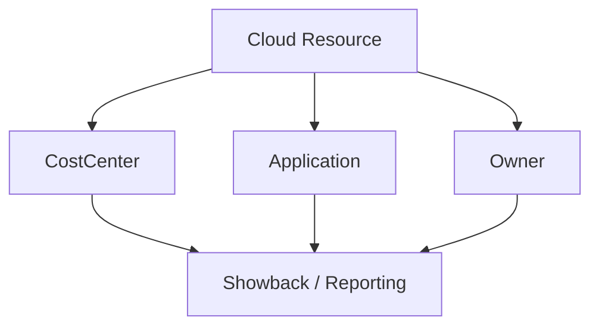

# Tag + Allocation Standard (Cost Center + Application + Owner)

> [!IMPORTANT]
> **Governance Change Policy:** Once marked **COMPLETE**, this standard is **IMMUTABLE**. Any deviation requires documented Risk Acceptance (RA) and expiration.

---

## Strategic Goal
Establish a mandatory tagging and allocation standard that enables **showback/chargeback**, accurate ownership, and reliable cost reporting. This prevents “unattributed spend,” reduces waste, and makes cloud cost governance auditable.

---

## What This Proves
- I treat tagging as a **financial control**, not a nice-to-have.
- I can design standards that drive accountable cost allocation across teams.
- I can produce evidence that tags are enforced, measured, and corrected.
- I connect cloud spend to business structure (cost centers, apps, owners).

---

## Governance Decisions
- Tags are required at creation time for in-scope resources.
- Tag values follow standardized formats to prevent reporting fragmentation.
- Enforcement is preventative (Policy deny where possible) with exception tracking.
- Non-compliant resources are corrected via remediation workflow.
- Allocation hierarchy is stable and documented (Cost Center → App → Owner).

---

## Scope & Non-Goals
| In scope | Out of scope (by design) |
| --- | --- |
| Tagging standard for cost allocation | Full TBM model implementation |
| Enforcement and compliance measurement | Complex custom tag inheritance logic |
| Remediation process | Full automation platform buildout |
| Baseline tag set | Department-specific optional tags |

---

## Operating Baseline
| Item | Standard |
| --- | --- |
| Required tags | CostCenter, Application, Owner |
| Optional tags (recommended) | Environment, DataClassification |
| Enforcement | Azure Policy (deny) + remediation workflow |
| Review cadence | Monthly |
| Evidence | Compliance export + remediation log |

---

## Standard Tag Dictionary
| Tag Key | Required | Format | Example | Purpose |
| --- | --- | --- | --- | --- |
| CostCenter | Yes | CC-#### or approved value | CC-1024 | Financial allocation |
| Application | Yes | AppName (no spaces) | BillingAPI | Service attribution |
| Owner | Yes | email or team alias | cloudops@ | Accountability |
| Environment | No (recommended) | Prod/NonProd | Prod | Filtering and governance |
| DataClassification | No (recommended) | Public/Internal/Confidential | Internal | Risk alignment |

---

## Visual Model (Allocation Hierarchy)

---

## Enforcement Model
Preventative enforcement is preferred to avoid retroactive cleanup.

| Method | When Used | Evidence |
| --- | --- | --- |
| Azure Policy (Deny) | New resource creation | Denied deployment event |
| Azure Policy (Audit/Modify) | Legacy or edge cases | Compliance report |
| Remediation workflow | Existing non-compliant assets | Remediation log |
| Exception Register | Approved deviations | Risk Acceptance record |

---

## Steps I Take (Only What Matters)
1. Define required tag keys and approved formats.
2. Deploy Azure Policy to deny creation of untagged resources.
3. Validate deny behavior using controlled test deployments.
4. Export compliance data to identify non-compliant resources.
5. Execute remediation with documented ownership.
6. Track tagging coverage trends monthly.
7. Review and expire tagging exceptions.

---

## Audit Tests

### Test of Design
- [ ] Required tag keys and formats are documented.
- [ ] Preventative enforcement exists via Azure Policy.
- [ ] Exception process requires approval and expiration.
- [ ] Review cadence and ownership are defined.

### Test of Effectiveness
- [ ] Untagged resources are blocked or flagged.
- [ ] Compliance reports show improving tag coverage.
- [ ] Remediation actions are recorded and traceable.
- [ ] Exceptions are reviewed and time-bound.

---

## Verification

**Expected**
- Cloud spend can be allocated to cost centers and applications.
- Resource ownership is always identifiable.
- Unattributed spend decreases over time.

**Observed**
- Captured during execution and retained as evidence.

---

## Evidence
Evidence Index: `./evidence/evidence-index.md`

Minimum artifacts:
- EV-YYYY-MM-DD-001 — Tag standard publication (this file)
- EV-YYYY-MM-DD-002 — Policy deny proof (missing tags)
- EV-YYYY-MM-DD-003 — Compliance export (coverage)
- EV-YYYY-MM-DD-004 — Remediation record (tag correction)

---

## Controls Mapped
- FinOps Framework: Allocation, Tagging, Governance
- (Optional) NIST 800-53: CM-2, CM-6

---

## Navigation
- Repo README: `../README.md`
- Pillar README: `./README.md`
- Related Packs:
  - `../02_Cloud_Guardrails/Azure_Policy_Definitions.json`
  - `./Budget_Alert_Thresholds.md`
